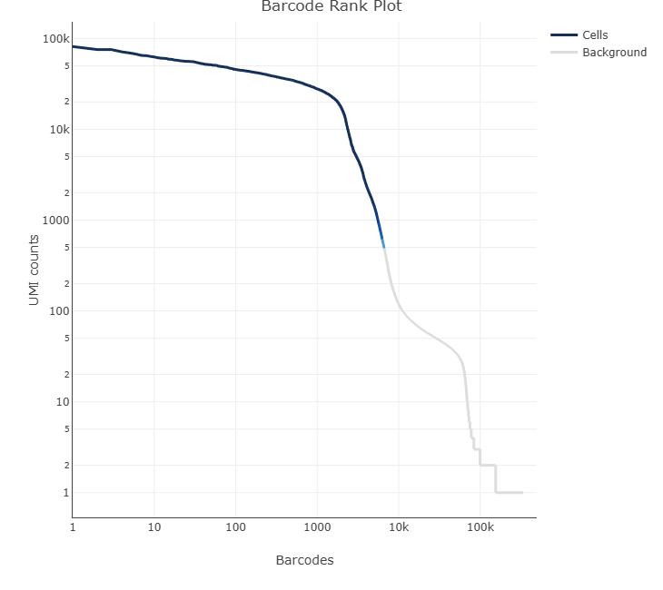

```{r setup, echo=FALSE, warning=FALSE, message=FALSE}
knitr::opts_chunk$set(
	echo = TRUE
)
```

```{r lib}
suppressPackageStartupMessages({
  library(dplyr)
  library(knitr)
  library(Seurat)
  library(patchwork)
  library(ggplot2)
})
```

# Overview

In this exercise, we explore the bioinformatics methods used by Liao et al. (2020) to process single-cell RNA-seq data starting from raw FASTQ files. Our goal is to gain exposure to the workflow and understand key filtering steps. The sample selected for interrogation, "BALF-C141", was derived from bronchoalveolar immune cells taken from the lung of a patient with mild COVID-19.

# FASTQ Processing Methods

## Obtain FASTQ files from GEO/ENA in bulk

Raw paired-read FASTQ files from this scRNA-seq experiment are available online under the GEO accession ID [GSE145926](https://www.ncbi.nlm.nih.gov/geo/query/acc.cgi?acc=GSE145926). To obtain direct links to each of the 12 samples in bulk, we query this accession ID in [SRA explorer](https://sra-explorer.info/), select the relevant samples, then download the metadata to a csv, shown below.

```{r, echo=FALSE}
read.csv("../samples/SampleList_covid.csv", header=FALSE) %>%
  arrange(V1) %>%
  kable(col.names = c("Accession ID", "Sample Name", "FASTQ Link"))
```

We then supply this .csv as an input to our sbatch script below to download all the FASTQs locally.

```{bash, code=readLines("get_fastq.sh"), echo=TRUE, eval=FALSE}
```

We now have the following file structure under `/scratch/${USER}/data`:

```         
.
|-- BALF-C141
|   |-- SRR11181954_1.fastq.gz
|   `-- SRR11181954_1.fastq.gz
|-- BALF-C142
|   |-- SRR11181955_1.fastq.gz
|   `-- SRR11181955_2.fastq.gz
|-- BALF-C143
|   |-- SRR11181956_1.fastq.gz
|   `-- SRR11181956_2.fastq.gz
|-- BALF-C144
|   |-- SRR11181957_1.fastq.gz
|   `-- SRR11181957_2.fastq.gz
|-- BALF-C145
|   |-- SRR11181958_1.fastq.gz
|   `-- SRR11181958_2.fastq.gz
|-- BALF-C146
|   |-- SRR11181959_1.fastq.gz
|   `-- SRR11181959_2.fastq.gz
|-- C100
|   |-- SRR11537948_1.fastq.gz
|   `-- SRR11537948_2.fastq.gz
|-- C148
|   |-- SRR11537949_1.fastq.gz
|   `-- SRR11537949_2.fastq.gz
|-- C149
|   |-- SRR11537950_1.fastq.gz
|   `-- SRR11537950_2.fastq.gz
|-- C152
|   |-- SRR11537951_1.fastq.gz
|   `-- SRR11537951_2.fastq.gz
|-- C51
|   |-- SRR11537946_1.fastq.gz
|   `-- SRR11537946_2.fastq.gz
`-- C52
    |-- SRR11537947_1.fastq.gz
    `-- SRR11537947_2.fastq.gz
```

Per the 10X Genomics Chromium Single Cell 5’ protocol, note that Read 1 is the 16nt barcode and 10nt UMI:

```         
(base) [wong.co@login-00 data]$ cd BALF-C141
(base) [wong.co@login-00 BALF-C141]$ zcat SRR11181954_S1_R1_001.fastq.gz | head
@SRR11181954.1 /1
GAACATCGTAACTGTATATTATTCTC
+
DCCC@;8C@7936;<->440.):8->
@SRR11181954.2 /1
AAGCCGCAGTGCGATGGTACACAGCG
+
B:DCDDB?CBC=<::BA6<>.@.9(A
@SRR11181954.3 /1
ACTGCTCCAGCCTGTGCCTGATGGTG
```

And Read 2 is the actual transcript:

```         
(base) [wong.co@login-00 BALF-C141]$ zcat SRR11181954_S1_R2_001.fastq.gz | head
@SRR11181954.1 /2
GTCTGGCCAGCTGGTGAACTGAATGTGAGTCACCTCTCTTCCAGTTGCTTTTTCTTTTTTATTTACAATGTTCAATTTCTGAATGATGTAAGCTGGACAT
+
BCBBB6B4BCBBBB;BBAA@CBCB:ACD@>9D95C5?BC@@A@B:CB?A6::B@?>?@@@B<;BA=BA7E3?ACB7AA@B>A@9?<CB+@C1AACC(:A>
@SRR11181954.2 /2
ATTGCGCCAGGTTTCAATTTCTATCGCCTATACTTTATTTGGGTAAATGGTTTGGCTAAGGTTGTCTGGTAGTAAGGTGGAGTGGGTTTGGGGCTAGGCT
+
<A@DDCCDCCB1@A<AD@=BBCCCAC;DCADCCCCBCDBDDDC=CACCACC6CD@BDACEC:BEAC>DB@CEBACCDDDCEE=CDC@4>CDDC(DCCD%=
@SRR11181954.3 /2
CCTTTCCTGTTCACTCTACCCTTTGACTCTAAATCTCAAAGCCAGTGTTGGGGCCCAGTGGCTCCATTCGATTGAAACATGGCCAATGATATCCAAGAGC
```

## Set up cellranger for the first time

As this is our first time using cellranger, there are a few setup steps to complete first:

1.  Download and unzip cellranger from 10X Genomics
2.  Download and unzip the 10X Genomics GRCh38 human reference dataset
3.  Ensure FASTQ files conform to [cellranger's expected format](https://www.10xgenomics.com/support/software/cell-ranger/latest/analysis/inputs/cr-specifying-fastqs): `[Sample Name]_S1_L00[Lane Number]_[Read Type]_001.fastq.gz` or `[Sample Name]_S1_[Read Type]_001.fastq.gz`

```{bash, code=readLines("setup_cellranger.sh"), echo=TRUE, eval=FALSE}
```

## Run cellranger on a select sample

Next, we run cellranger in `count` mode to perform sample de-multiplexing, barcode processing, and single-cell 5’ UMI counting with human GRCh38 as the reference genome. At this stage, we are hard-coding to supply just one selected sample, "BALF-C141," for testing purposes but can modify the code at a later time to loop over multiple samples.

```{bash, code=readLines("run_cellranger.sh"), echo=TRUE, eval=FALSE}
```

The key outputs reside in the subfolder `outs/`, with the following file structure. The files we are primarily interested in are the summary report `web_summary.html` and the feature barcode matrix `filtered_feature_bc_matrix.h5`, which we have copied into `/home/${USER}/propeller` as well as this repository under `results/`.

```         
.
|-- analysis
|   |-- clustering
|   |-- diffexp
|   |-- pca
|   |-- tsne
|   `-- umap
|-- cloupe.cloupe
|-- filtered_feature_bc_matrix
|   |-- barcodes.tsv.gz
|   |-- features.tsv.gz
|   `-- matrix.mtx.gz
|-- filtered_feature_bc_matrix.h5
|-- metrics_summary.csv
|-- molecule_info.h5
|-- possorted_genome_bam.bam
|-- possorted_genome_bam.bam.bai
|-- raw_feature_bc_matrix
|   |-- barcodes.tsv.gz
|   |-- features.tsv.gz
|   `-- matrix.mtx.gz
|-- raw_feature_bc_matrix.h5
`-- web_summary.html
```

## Assess cellranger web summary

The web summary generated by cellranger, [web_summary.html](../results/web_summary.html), provides some quality metrics on cells based on barcodes and UMIs detected in each cell as well as mapping quality to the reference genome.



This barcode rank plot exhibits the characteristic "cliff and knee" shape of a typical sample. The steep dropoff in UMI counts per cell/barcode means there is good separation between cell-associated barcodes (abundant UMI count suggesting robust transcripts from real cells) and barcodes from blank droplets (extremely low, background-level UMI count suggesting either lack of a GEM or lack of a cell). We default to using cellranger's probabilistic model for calling cells to focus only on the good-quality cells, indicated by the blue colored portion of the curve.

Separately, we also note high quality in valid barcode detection (90.7%), valid UMI detection (98.3%),  Q30 bases in the barcode (97.8%), and reads mapped to the genome (97.6%). This was a high-quality run.

# Post-Processing Methods using Seurat

## Load data

Below, we load the filtered .h5 gene count data generated by CellRanger and store it into a Seurat object. Note that we could have set a threshold for `min.cells` (features were detected in at least this many cells) and `min.features` (cells where at least this many features were detected), but Liao et al. (2020) did not mention deviating from the default for these parameters.

```{r}
# Load the filtered dataset generated by CellRanger
BALF_C141.data <- Read10X_h5("../results/filtered_feature_bc_matrix.h5")
# Initialize Seurat object with raw data
BALF_C141 <- CreateSeuratObject(counts = BALF_C141.data,
                                project = "covid")
```

## QC and Cell Filtering

Next, we assess the quality of the cells based on the number of unique features/genes detected (`nFeature_RNA`, extremely low gene count suggests empty droplets or poor quality cells while extremely high gene count suggests doublets) and the percentage of reads that map to mitochondrial genes (`percent.mt`, a high percentage suggests contamination due to low-quality or dying cells). `nCount_RNA` is the total number of molecules detected in the cell.

```{r}
# Calculate percentage of genes that are mitochondrial
BALF_C141[["percent.mt"]] <- PercentageFeatureSet(BALF_C141, pattern = "^MT-")
VlnPlot(BALF_C141, features = c("nFeature_RNA", "nCount_RNA", "percent.mt"), ncol = 3, pt.size = 0.0001)
# Create scatterplots to view trend
FeatureScatter(BALF_C141, feature1 = "nCount_RNA", feature2 = "nFeature_RNA") + 
  theme(legend.position="none")
FeatureScatter(BALF_C141, feature1 = "nCount_RNA", feature2 = "percent.mt") + 
  theme(legend.position="none")
```

Liao et al. (2020) filtered the cells using the following criteria: "gene number between 200 and 6000, UMI count above 1000 and mitochondrial gene percentage below 0.1." We can reason that this will eliminate the following:

-   the cluster of cells in the first violin plot with extremely low feature count
-   the cluster of cells in the third violin plot with extremely high (\~90%) mitochondrial mRNA
-   roughly, the upper tail observed in the nCount vs nFeature graph

We apply this feature below using `subset()` then re-plot the same figures.

```{r}
BALF_C141 <- subset(BALF_C141, subset = nFeature_RNA > 200 & nFeature_RNA < 6000 & nCount_RNA > 1000 & percent.mt < 10)
VlnPlot(BALF_C141, features = c("nFeature_RNA", "nCount_RNA", "percent.mt"), ncol = 3, pt.size = 0.0001)
FeatureScatter(BALF_C141, feature1 = "nCount_RNA", feature2 = "nFeature_RNA") + 
  theme(legend.position="none")
FeatureScatter(BALF_C141, feature1 = "nCount_RNA", feature2 = "percent.mt") + 
  theme(legend.position="none")
```

## Normalization

Liao et al. (2020) normalizes the filtered gene-barcode matrix using the LogNormalize method.

```{r}
BALF_C141 <- NormalizeData(BALF_C141, normalization.method = "LogNormalize")
```

## Selection of Highly Variable Genes

Liao et al. (2020) then "analyzed by principal component analysis (PCA) using the top 2,000 most variable genes." They do not mention a selection method for choosing the top variable features, so we use the default, `vst`, which standardizes feature values using the observed mean and expected variance predicted by local polynomial regression (loess) between log(variance) and log(mean).

```{r}
BALF_C141 <- FindVariableFeatures(BALF_C141, selection.method = "vst", nfeatures = 2000, verbose = FALSE)
p <- VariableFeaturePlot(BALF_C141) + theme(legend.position = "bottom")
LabelPoints(plot = p,
            points = head(VariableFeatures(BALF_C141), 10),
            repel = TRUE)
```

## Scaling

## Dimensionality Reduction with PCA

# References

Liao, M., Liu, Y., Yuan, J. et al. Single-cell landscape of bronchoalveolar immune cells in patients with COVID-19. Nat Med 26, 842–844 (2020). <https://doi.org/10.1038/s41591-020-0901-9>
